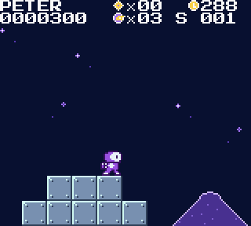
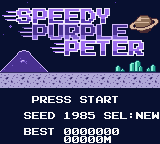
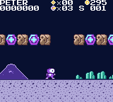
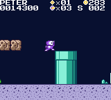
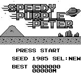
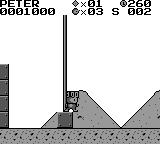
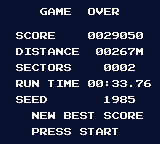

<h1 align="center">SPEEDY PURPLE PETER</h1>

<p align="center">
  <b>An endless, procedurally generated speedrun platformer for the Game Boy and Game Boy Color.</b><br>
  <i>One level. It never ends. How far can you get?</i>
</p>

<p align="center">
  
</p>

<p align="center">
  
  
  
</p>

---

Peter is a little astronaut in a purple space suit, and the run in front of him has no end. It plays
like a classic 1985 first level, the one everybody knows by heart: run, jump, stomp, bump the
blocks, grab the power-ups, slide down past the pole and keep going. Here it simply never stops.
Every few hundred metres a **beacon** marks the end of a sector; touch it, bank your leftover time as
points, and you are straight into the next sector. No cutscene, no loading, no break.

The level is generated from a **seed** as you go. The same seed is always the same run, so you can
race your friends on identical ground: pick a seed on the title screen and share it.

## The idea

- **The physics are the classic ones.** Peter's speeds, accelerations, skids, air control and
  jump arcs use the original game's constants (in its own sub-pixel units): walk speed, run speed,
  the 10-frame run memory after you let go of B, the three jump strengths picked by your speed at
  takeoff, the lighter gravity while A is held, the fall-speed cap. A standing jump clears four
  blocks, a running jump five. If your thumbs know that game, they know this one.
- **The enemies behave like the classic ones**, with a space-age coat of paint (everything here is
  original art and sound; no Nintendo characters, graphics or music):

  | Here | Behaves like | |
  | --- | --- | --- |
  | **Gloop**, a one-eyed alien blob | the mushroom walker | walks, falls off ledges, turns at walls; stomp it flat |
  | **Dome-bot** (green) | the green turtle | stomp it into its **dome pod**; touch the pod to kick it; a sliding pod knocks out everything in its way (and bounces back at you) |
  | **Dome-bot** (red) | the red turtle | the same, but turns around at ledges |
  | **Jet Dome-bot** | the winged turtle | hops along; stomp it and it loses its jet |
  | **Moon Chomper**, a one-eyed space worm | the pipe plant | rises out of tubes; stays down while you stand next to its tube |
  | **Comet** | the bullet | fired from launchers; stomp it |

  | Here | Is | |
  | --- | --- | --- |
  | **Supply pod** (the glowing hex hatch) | the "?" block | bump it from below: a star bit or a power-up |
  | **Meteorite block** | the brick | big Peter smashes it; some hide many star bits, a power-up or a supernova |
  | **Ringed planet** | the mushroom | grow big |
  | **Plasma flower** | the fire flower | the blaster: B fires bouncing plasma shots |
  | **Supernova** | the star | invincible for ten seconds |
  | **Star bits** | coins | 200 points; 100 of them give a life |
  | **Tubes** | pipes | |
  | **Beacon** | the flagpole | the higher you touch it, the more it scores; your remaining time counts in at 50 a tick |

- **It's all about the score.** Stomps chain (100, 200, 400 ... up to a 1UP) while you stay in
  the air, a kicked pod's victims chain too, the beacon pays for height, and **every beacon turns
  your leftover time into points**: the faster you run a sector, the more it's worth. The clock
  (300 at the start of each sector) ticks one unit every 24 frames; when it hits 100 the music
  hurries.
- **Lives and checkpoints.** You start with three lives. Losing one puts you back at the start of
  the sector you are in, rebuilt exactly as it was. Lose them all and the run is over: score,
  distance, sectors, run time and seed are shown, and your best score and distance are saved.
- **The difficulty climbs.** Sector 1 is gentle (a flat start, a power-up pod straight away, short
  pits). Pits get wider (up to five blocks, which needs a running jump), Chompers move into the
  tubes, red and jet Dome-bots and comet launchers appear, floating platforms span the gaps.
- **Built for speedrunners.** No breaks between sectors, a deterministic run per seed, an in-game
  run timer in frames, and an instant reset: **START, then SELECT** restarts the same seed.

## Play it

- **Emulator:** open the `.gb` in SameBoy, mGBA, Gambatte, BGB, Emulicious or any other.
- **Real hardware:** copy the `.gb` to a flash cart (EverDrive and friends). It runs on the
  original Game Boy, Pocket, Color, Analogue Pocket, ModRetro Chromatic and the like.

Download the ROM from **[Releases](../../releases/latest)**. There is only ever one release: the
latest build, tagged with its date. Every pull request's ROM is also attached to its CI run.

### Controls

| Button | |
| --- | --- |
| D-pad left / right | walk |
| **B** (hold) | run; with the plasma flower, B also fires |
| **A** | jump (hold for a higher jump) |
| D-pad down | duck (when big) |
| **START** | pause; while paused: **START** resumes, **SELECT** restarts the seed, **A+B** quits to the title |

On the title screen: **START** plays the seed shown, **SELECT** rolls a new random seed, and
**left / right / up / down** edit the seed's four hex digits.

### The HUD

```
PETER     *x07   ^276        star bits, time left
0048000   @x03   S 005       score, lives, sector
```

<p align="center">
  
  
  
</p>

## Under the hood

The game is C (GBDK-2020 4.3, SDCC) with a few small SM83 assembly routines in the hottest
spots. The cartridge is **MBC5 + RAM + battery**, 64 KB, CGB-enhanced: colour and double speed on
a Game Boy Color, and fully playable on a 1989 DMG. It runs at a steady 60 fps: over 66,000 test
frames per machine, the Game Boy Color never misses one and the DMG misses 2.

```
src/core/   the game itself, portable C (SDCC for the Game Boy, gcc for the tests and tools)
  sim.c         Peter, the classic physics, blocks, the level ring, camera, clock, beacons
  ents.c        enemies, power-ups, plasma shots, effects
  level.c       the generator: sectors of segments, (seed, sector) -> columns
  tiles.h sim.h level.h sim_int.h
src/gb/     the Game Boy front end
  main.c        boot, interrupts (HUD split, VBlank column/HUD/tile writes), the frame loop
  render.c      BG streaming, sprites, HUD, sound events
  screens.c     title + seed entry, pause, game over, the battery save
  sound.c       a 4-channel engine: original songs, 17 effects, click-free on real hardware
  assets.c      generated from assets/*.txt by tools/gen_assets.py
assets/     hand-editable ASCII-art tiles, sprites, font, title, palettes
tools/      gen_assets.py · preview_assets.py · sppgen.c (the level and bot on the command line)
            screenshots.py · render_audio.py
tests/      test_core.c (+ bot.c) · test_sound.c · test_assets.py · test_rom.py
```

- **One simulation, two compilers.** The whole game logic is a pure function of the seed and the
  buttons pressed, in one plain struct. The host build runs the tests and a search bot; the ROM
  runs the same code. The ROM tests feed the bot's winning inputs to the real ROM in PyBoy and
  require the exact same end state (position, score, sectors, star bits, time) on DMG and CGB.
  That test found a real SDCC code-generation bug (a signed comparison that tested the wrong
  byte, in both GBDK 4.3 and 4.5); see [docs/DESIGN.md](docs/DESIGN.md).
- **An endless level in 512 bytes.** The level is a ring of 32 columns, generated just ahead of
  the camera. The BG map is a 16-column ring streamed one column at a time by the VBlank handler.
  A death rebuilds the checkpoint sector from `(seed, sector)` alone.
- **Every sector is beatable, and the tests prove it.** A search bot plays with button presses
  only (run, jump, wait, back up, with backtracking) and must clear 12 sectors of terrain on 40
  seeds and 8 sectors with enemies on 12 seeds, under the real clock.

### Build

You need GBDK-2020 4.3 (at `/opt/gbdk`, or set `GBDK_HOME`), gcc, Python 3, and
`pip install pyboy pillow numpy` for the emulator tests.

```sh
make rom          # -> build/speedy-purple-peter.gb (+ .sym)
make test         # everything below
make test-host    # physics, generator, mechanics and the search bot; the sound engine
make test-assets  # the asset pipeline
make test-rom     # PyBoy on DMG + CGB: the ROM plays exactly like the host (8 seeds), the frame
                  # budget, title, pause, save
make screenshots  # regenerate docs/screens
```

`build/sppgen` puts the level on your command line:

```sh
build/sppgen show 0x1985 0        # ASCII map of sector 0 of seed 1985
build/sppgen bot 0x1985 12        # let the bot play 12 sectors: time, score, distance per sector
build/sppgen bot 0x1985 12 god    # terrain only (no enemies)
```

### CI and releases

[GitHub Actions](.github/workflows/ci.yml) installs GBDK, runs every test, builds the ROM and
uploads it as an artifact. When a push to the default branch passes, it publishes a release
**tagged with the date** and **deletes every older release**, so there is only ever one: the latest.

Design notes, the physics constants and the performance budget are in
**[docs/DESIGN.md](docs/DESIGN.md)**; the module contracts are in
**[docs/CONTRACTS.md](docs/CONTRACTS.md)**.

## License

MIT, see [LICENSE](LICENSE).
